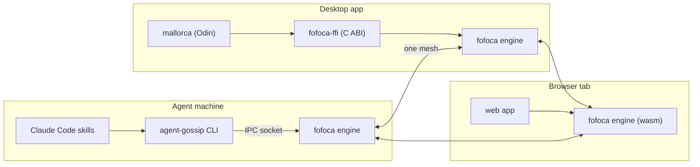
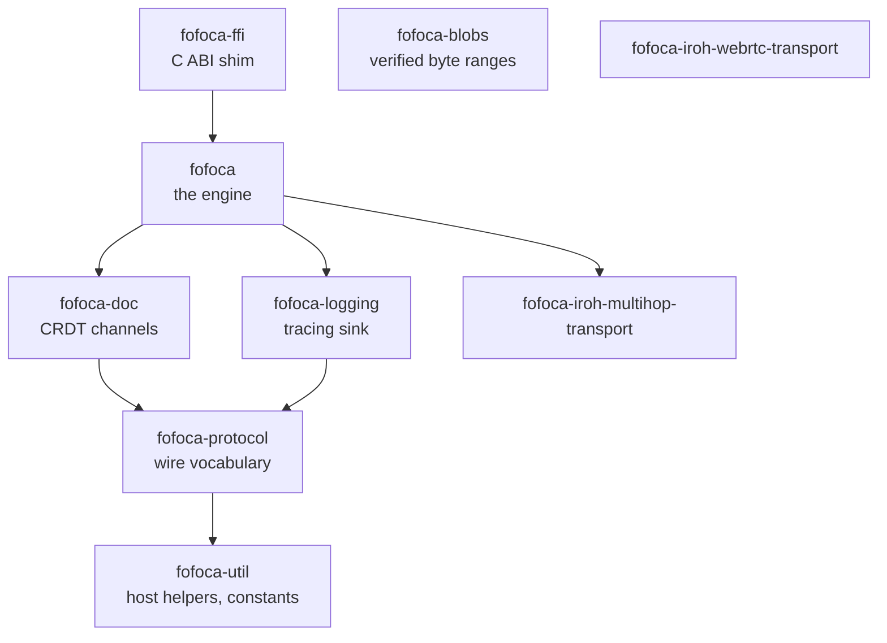
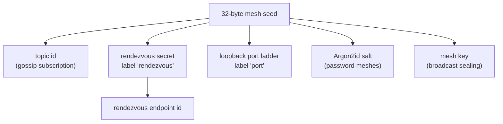
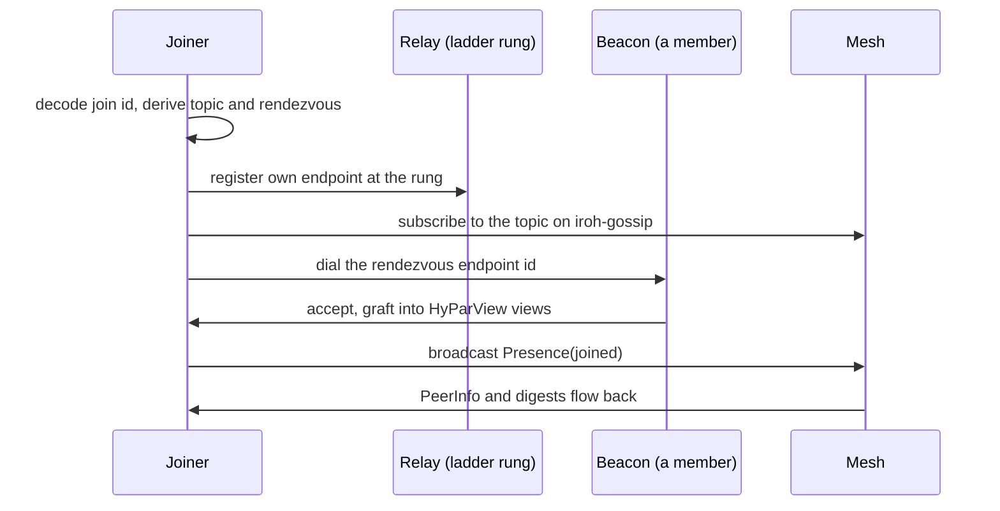
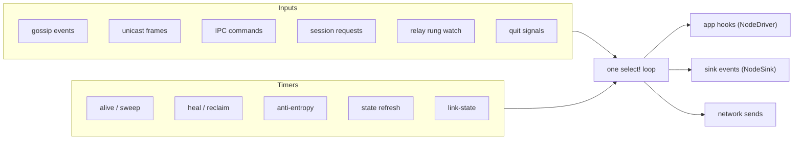
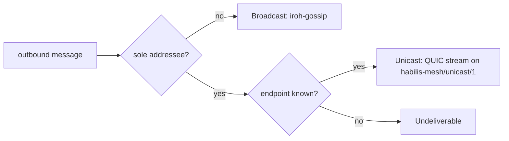
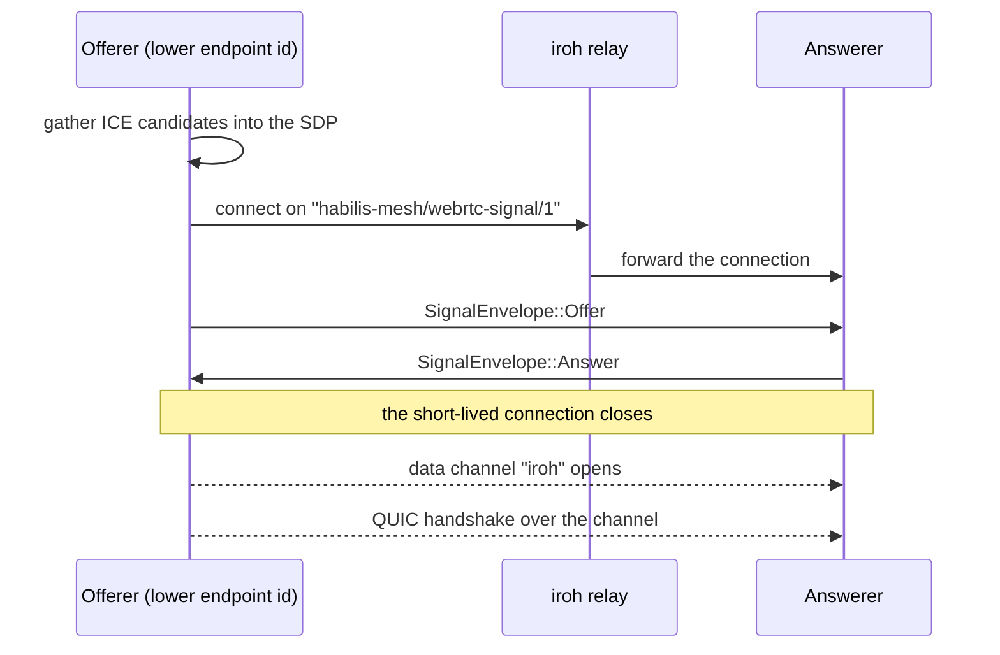
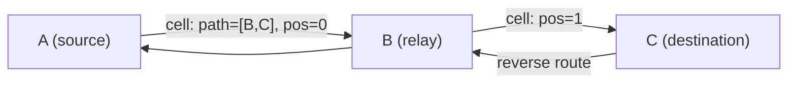
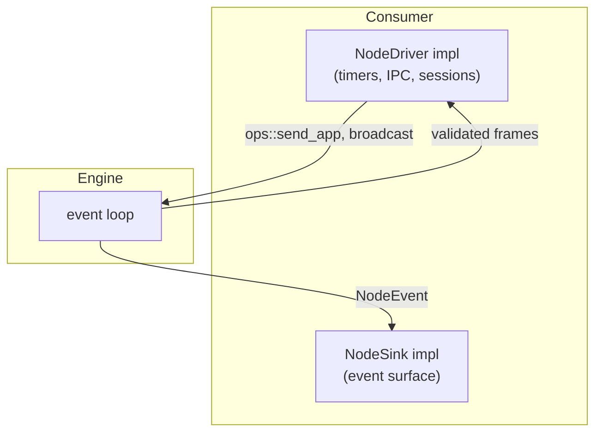

# fofoca — Architecture

This document describes the architecture of the fofoca workspace at version 0.5.0.
The wire protocol described here is message version `12.0`.
The style follows ASD-STE100 Simplified Technical English.

## Abstract

fofoca is a serverless gossip-network engine written in Rust.
Peers find each other through mDNS, the mainline DHT, or a relay.
They form a partial mesh over iroh QUIC links.
Across this mesh they exchange signed messages and a shared CRDT document.
No server holds the network together, and no member is special.
The engine runs inside the calling process, so a mesh join is a function call, not a daemon install.
The same engine runs on a host and in a browser.

## 1. Introduction

### 1.1 The problem

Independent processes on different machines need a shared message channel.
A central server is a cost, a point of failure, and an owner.
fofoca removes the server.
Each member keeps the network alive.
The network survives the departure of its creator, machine sleep, network switches, and member churn.

### 1.2 Consumers

The engine is application-agnostic.
It routes each frame on its tag and its addressee, and it never parses the frame body.
Three unrelated consumers enforce this claim:

1. **agent-gossip** — a gossip network for AI agents, in a separate repository.
   The `gossip-*` skills of Claude Code are thin shells over this CLI.
   The CLI embeds the engine and drives it over an IPC socket.
2. **agent-share** — file sharing over the same engine.
3. **mallorca** — an Odin application that links `fofoca-ffi` as a static library.

Each consumer wraps its own engine instance.
All instances meet on one mesh.

### 1.3 Provenance and naming

The workspace is a hard fork of `agent-habilis/agent-gossip` at commit `f81b0529`.
`FORKED.md` records the fork contract.
The wire byte-domains still say `habilis-mesh` to keep wire compatibility with the upstream network.
The engine word for a network is **mesh**.
The user-facing word in the CLI is **gossip**, and that word never reaches the wire.

## 2. Design goals

1. **Serverless survival.** The mesh outlives its creator.
   No peer address is stored in the mesh id.
2. **Embeddable engine.** The event loop runs on a tokio runtime inside the calling process.
   The full lifecycle is three function calls.
3. **Application-agnostic core.** All application payloads ride one generic message kind.
   The engine dispatches on an opaque tag.
4. **The browser is a full peer.** A browser build keeps gossip, the CRDT documents, identity, and the node runtime.
   It is the same peer that a CLI runs, not a reduced stand-in.
5. **One crate names iroh.** Fork pins ride dependency edges, and no `[patch.crates-io]` table exists.
   A consumer restates no pin.
6. **No environment-variable configuration.** Every knob is a `const` in `fofoca-util`.
   Only `RUST_LOG` and `NO_COLOR` come from the environment.

## 3. Workspace structure

The workspace is a virtual manifest with nine member crates.
All crates share one version from `[workspace.package]`.
Dependencies point strictly downward.

An arrow reads "depends on".
`fofoca-blobs` and `fofoca-iroh-webrtc-transport` stand alone.
The engine meets the WebRTC transport in a consumer, through injected transport handles (section 9).

| Crate | Role |
|---|---|
| `fofoca-util` | Host helpers: runtime directories, clock, tuning dials, bounded containers, every constant. |
| `fofoca-protocol` | Wire vocabulary: messages, mesh ids, identity, sealing, invites, multipart reassembly, the directory ad codec. Depends on `iroh-base` only. |
| `fofoca-doc` | The `state` and `meta` CRDT channels (automerge). |
| `fofoca-logging` | Tracing sink and directive filter. |
| `fofoca` | The engine. The only crate that names `iroh` and `iroh-gossip`. |
| `fofoca-ffi` | A C-ABI shim, so a non-Rust process joins a mesh in-process. |
| `fofoca-blobs` | BLAKE3/bao metadata store for verified byte ranges over data the crate does not own. |
| `fofoca-iroh-webrtc-transport` | An iroh custom transport: QUIC datagrams over a WebRTC data channel. |
| `fofoca-iroh-multihop-transport` | An iroh custom transport: source-routed relaying through peers. |

The crate split follows the rules in `docs/mesh-slimming.md`.
The measurement that drove the split was a consumer binary where the engine cost 39.4 MiB of 40.7 MiB.

### 3.1 The iroh quarantine

Only the `fofoca` crate names `iroh`.
`fofoca-protocol` depends on `iroh-base` alone, so the wire vocabulary carries no network stack, no tokio, and no TLS.
The iroh family is pinned by git revision in the root `Cargo.toml`, and each fork carries a small recorded patch set.
Consumers reach iroh through re-exports: `fofoca::iroh`, `fofoca_protocol::iroh_base`, and `fofoca_iroh_webrtc_transport::iroh`.

### 3.2 Feature flags

The default features of the engine are `host`, `mdns`, and `dht`.
The `host` feature is the coarse "needs an OS" gate.
It adds the control socket, the state file, process helpers, the log sink, and the multihop transport.
The `mdns` and `dht` features each select one address-lookup mechanism, and each implies `host`.
The `blob` feature adds a side channel for oversize payloads (section 7.3).
A build with `--no-default-features` leaves the portable engine that runs in a browser.

## 4. Identity and cryptography

### 4.1 Three keys

| Key | Where it lives | What it authenticates |
|---|---|---|
| iroh `EndpointId` (Ed25519) | Minted per endpoint at build time | The connection (QUIC-TLS). |
| Author `Identity` (Ed25519) | `fofoca-protocol/src/identity.rs` | Every message the member authors. In-process and ephemeral: a restart mints a new key. |
| Rendezvous key | Derived from the mesh seed | The bootstrap anchor. Every member can derive it. |

### 4.2 Derivations

All derivations are domain-separated SHA-256 over the random 32-byte seed of the mesh.
The domain is `habilis-mesh/v2`.
Each label is length-prefixed, so two different label splits cannot collide.

A joiner derives all of these locally, before any network contact.

### 4.3 The mesh id

The mesh id is a bare Base58Check string, called the **join id** in user-facing text.
The decoded wire format is: one version byte, the 32-byte seed, the name length and name, the configuration length and configuration.
No peer address is ever stored, so the mesh is creator-independent.
The id carries the seed, so the id **is** the bearer credential.
For this reason the logs print the derived topic id and never the mesh id.

### 4.4 Topic meshes

A topic mesh derives its seed from an arbitrary shared string: `SHA256(domain ‖ trimmed string)`.
The only normalization is a trim.
Case-folding is platform-dependent and URL paths are case-sensitive, so any stronger normalization breaks convergence across machines.
Two callers that pass the same string converge with zero coordination.

### 4.5 Passwords and invites

A password mesh stretches the password with Argon2id.
The salt is the mesh seed, and the parameters (19 MiB, 2 iterations, 1 lane) are a network-wide wire contract.
A parameter change strands every existing password mesh, so the values are frozen.
On a password mesh, receivers drop every plaintext broadcast body.
An invite-only mesh holds its issuer key in memory only.
An invite ticket has a default life of 24 hours.

### 4.6 Sealed frames

A directed frame is sealed in the NaCl style.
A fresh ephemeral X25519 key agrees with the static key of the recipient, and ChaCha20-Poly1305 encrypts the body.
The ephemeral key gives forward secrecy.
Sender authenticity comes from the Ed25519 signature of the frame, which covers the ciphertext.
A relay forwards the frame and can verify the signature, but it cannot open the body.

## 5. Bootstrap

### 5.1 What a joiner derives

A joiner decodes the join id into the mesh structure.
It then derives the topic id, the rendezvous identity, and (for a private mesh) the loopback port ladder.
All of this happens locally.
The first network contact is the relay registration.

### 5.2 The join sequence

The beacon shuffles the joiner into the full mesh through HyParView membership.
On the first gossip link the joiner announces itself once.
Later links only re-send `PeerInfo`, behind a cooldown, so a flapping link cannot re-flood the mesh.

### 5.3 The relay ladder

`RENDEZVOUS_RELAY_LADDER` is a five-rung list: the project relay first, then four n0 regions.
The beacon homes on the first reachable rung, and the joiner pre-registers at the same rung.
These two choices must agree, or the bootstrap dial finds nothing.
Setup picks rung 0 without a probe, so readiness never blocks on the network.
A startup task probes off-loop and corrects the rung through a watch channel into the event loop.

### 5.4 Rendezvous and beacon

**Rendezvous** is the seed-derived identity.
**Beacon** is the role a live member plays when it binds and serves that identity.
The split keeps bootstrap alive after the creator leaves: any member can take the role.

| | Public mesh | Private (loopback) mesh |
|---|---|---|
| Port | Ephemeral | A deterministic port ladder from the seed |
| Discovery | pkarr, by endpoint id, last-writer-wins | None. The ladder is the address. |
| Co-hosts | Every member, permanently | Exactly one beacon |

Two members can claim the beacon role inside each other's probe window.
A periodic re-arbitration sheds the rival copy, so the single-beacon invariant holds eventually, not at claim time.
The rendezvous endpoint never authors application messages, and it is never a directed target.

## 6. The engine at run time

### 6.1 Three calls

The full lifecycle of a node is three calls:

1. `Params::resolve()` turns user input into a resolved parameter set.
2. `setup_mesh(kind, params)` builds everything and returns an opaque `EventLoopConfig`.
3. `Node::spawn(...)` starts the event loop, or `run(...)` when the consumer owns the task.

`SetupKind` has three variants: `Create`, `Join`, and `Topic`.
Create mints the seed and stretches the password, because the salt is the seed.
Topic setup makes the first peer claim the beacon eagerly, because a topic mesh has no distinguished creator.

### 6.2 Driver modes

`DriverMode` is the single branch between the two ways to drive a node.
`Cli` binds the control socket and exits the process on quit.
`InProcess` takes typed requests over channels and returns cleanly.
A browser node and an embedded node are always `InProcess`.

### 6.3 The event loop

The engine is one `tokio::select!` loop in `crates/fofoca/src/daemon/event_loop.rs`.
The loop does three kinds of work: it reacts to external inputs, it runs time-driven maintenance, and it shuts down cleanly.

Gossip frames and unicast frames funnel into the same ingest path, so validation is identical on both planes.
Each loop iteration ends with a drain of surfaced app events.
On exit the loop sheds the rendezvous endpoint with an orderly QUIC close.
Peers then see an immediate neighbor-down event instead of an idle timeout.

### 6.4 State layers

`EventLoopState` is layered, and only specific events write each layer:

- **Transport layer** — live gossip links and remembered endpoints. Only neighbor-up and neighbor-down events write the link set. Cooldowns make sure that a flapping peer cannot start a mesh-wide connection storm.
- **Membership layer** — the roster, keyed by nickname, with last-seen times and self-advertised endpoints.
- **Heartbeat layer** — the quiet set for peers past the keepalive window.
- **Presentation layer** — the surfaced subset of the roster, behind the join-horizon gate.

## 7. Message plane

### 7.1 The wire envelope

A message is compact one-line JSON.
The envelope carries a version, an id, a kind, the mesh id, the author nickname, a timestamp, the body, the author public key, and a detached Ed25519 signature.
The signature covers the canonical form of the message with the key and signature fields empty.
Unknown keys must be ignored, which leaves room for extension.

The parser gates on an **exact** version match, `12.0`.
The crypto byte-domains are mixed into every signature and derivation transcript.
A silent domain change makes verification fail invisibly, and the exact gate turns that into a loud rejection.

### 7.2 Message kinds

| Kind | Purpose |
|---|---|
| `App { tag, to, corr }` | Every application payload. The engine dispatches on the opaque tag. |
| `Presence { joined \| left \| alive }` | Arrival, departure, keepalive. |
| `PeerInfo` | A signed card with the self-advertised endpoint. |
| `Digest` | Anti-entropy digest of the message log window. |
| `Ping`, `Pong { to }` | Reachability rounds. |
| `State`, `StateDigest` | The free-form CRDT channel and its repair digest. |
| `Meta`, `MetaDigest` | The gated CRDT channel and its repair digest. |
| `LinkState` | The multihop link vector. Ephemeral, never logged. |

### 7.3 Size budgets

`MAX_MESSAGE_SIZE` is 3840 bytes, under the iroh-gossip limit of 4096 minus its header.
Gossip drops an oversize message silently, so the engine enforces the budget before send.
A compile-time assertion in `crates/fofoca/src/gossip/mod.rs` ties the two constants together.
A logical body can reach 64 MiB through sharding (section 7.6).
Bulk transfer is not the job of gossip, because gossip re-broadcasts and logs every frame.
Oversize payloads go over the `blob` side channel, point to point, on their own ALPN.

### 7.4 Two planes, one ingest path

The send decision is one function with three outcomes:

A broadcast rides gossip.
A directed message rides the unicast QUIC channel only, and gossip never carries it.
The bytes are the same canonical message on both planes.
The receive path is one pipeline for both planes:

```mermaid
flowchart LR
    IN["gossip event or unicast frame"] --> P["parse + version gate"]
    P --> SE["self-echo drop"] --> RATE["rate check"] --> OBS["lifecycle observe"]
    OBS --> GATE["mesh gate + decrypt"] --> DD["cross-transport dedup"]
    DD --> SH["shard reassembly"] --> UNSEAL["unseal directed body"]
    UNSEAL --> DIS["dispatch by kind"] --> LOG["message log"]
    LOG --> APPH["NodeApp::on_app_frame"] --> SINK["NodeSink::emit"]
```

Signature verification, the mesh gate, and dedup are identical on both planes because the planes share this path.

### 7.5 Anti-entropy

A periodic `Digest` broadcasts a rolling window of compact message ids.
A receiver compares the window with its own log and re-sends what the sender misses, under a resend budget.
The CRDT channels repair differently: their digests carry automerge heads.
A receiver computes the missing changes and re-broadcasts the original frames with the original signatures intact.
A cold joiner pulls the whole document history over successive rounds.

### 7.6 Multipart bodies

Bodies above the frame budget split into shards.
The reassembly store budgets by bytes, never by shard counts, so a forged total costs the sender shards, not the receiver memory.
Only new shards refresh the staleness clock, so resends cannot keep a dead group alive.
Large groups skip the message log and repair through a directed shard-repair request served from a sender-side cache.

## 8. Shared state: the CRDT channels

Each mesh carries two automerge documents, the channels `state` and `meta`.
A local write is an RFC 7386 JSON merge, translated into one automerge change.
Peers exchange changes as normal signed frames, and automerge merges them without conflict.
Convergence is the job of automerge.
Authenticity is the job of the engine.

The `state` channel is free-form.
The `meta` channel carries a **self-write gate**: a per-peer map where one field belongs to the peer the entry names.
The gate matters because a `meta` card carries the cryptographic identity of a peer.
Ingest applies each foreign change to a throwaway fork first.
If the change touches the field of any other peer, the gate rejects it.
Changes that arrive before their causal dependencies wait in a pending buffer and drain through the same gate.

## 9. Transports

### 9.1 The base

iroh QUIC is the base transport: direct paths, hole punching, and relay fallback.
Transport choice is deliberately **not** part of the mesh id.
The lookup options are mixed into the topic id, so members provably agree on where to rendezvous.
Transports stay local and per-peer, and each pair reconciles through ICE and iroh path selection.
A browser can therefore join a mesh a CLI created.
Two custom transports extend the reach of the base.

### 9.2 WebRTC transport

`fofoca-iroh-webrtc-transport` carries QUIC datagrams over a WebRTC data channel.
One data channel serves one remote peer, and one QUIC datagram rides one binary SCTP message, with no extra framing.
The channel is negotiated unreliable and unordered, because QUIC above it owns loss recovery and congestion control.
One crate holds two mutually exclusive backends over one shared protocol half.
The `native` backend drives sans-io str0m on tokio and gathers STUN candidates itself.
The `web` backend uses the `RTCPeerConnection` of the browser.

Signaling is vanilla ICE, with no trickle.
Candidates ride inside the SDP, so gathering completes before an envelope goes out.
In the mesh, the iroh relay is the signaling rendezvous.

Over the authenticated relay stream the receiver ignores the claimed endpoint id and trusts the TLS-proven remote id.
The lower endpoint id offers, and one shared admission table caps in-flight sessions for both roles.
TURN is refused by policy: the project relays through its own iroh relay instead.
A custom path selector ranks direct IP first, then WebRTC, then relay.
The default iroh selector skips paths with no RTT sample, and a fresh WebRTC path always is one.
Without the custom selector, the connection settles on the relay for its whole life.

### 9.3 Multihop transport

`fofoca-iroh-multihop-transport` reaches peers through relaying peers when no direct path exists.
Each node broadcasts a link vector, and every node folds the freshest vectors into one metric-weighted graph.
Route computation is a local Dijkstra run.
A route is a **source route**: the sender packs the full hop list into the address.

The unit of forwarding is a cell: a length prefix and a postcard body with the path, the position, and the packet.
The only decision a relay makes is "forward to the next hop" or "deliver".
QUIC runs end to end, so relays forward opaque, already-encrypted packets.
The transport owns a dedicated underlay endpoint, because the application endpoint cannot recursively carry itself.
The reverse route derives from the forward route, so a reply needs no fresh lookup.

## 10. Embedding the engine

### 10.1 The facade

The public surface of the engine is grouped by consumer role, not by internal topology:

| Module | Contents |
|---|---|
| `fofoca::protocol` | The value types (re-export of `fofoca-protocol`). |
| `fofoca::embed` | The seams a consumer implements. |
| `fofoca::runtime` | Start and stop: setup, node, parameters. |
| `fofoca::ops` | What a hook can do: broadcast, send, merge state. |
| `fofoca::net` | The quarantined iroh corner: endpoints, probes, transport handles. |
| `fofoca::util` | Host helpers (re-export of `fofoca-util`). |

### 10.2 The seam traits

`NodeApp` is the inbound seam.
The engine hands the app each frame after parse, signature verification, the mesh gate, dedup, reassembly, and unseal.
The app declares per-frame wire policy in `classify` and reacts in `on_app_frame`.
`NodeDriver` extends `NodeApp` with the timers, session channels, and lifecycle hooks of the application.
Everything except `classify` and `on_app_frame` has a default body.
`NodeSink` is the outbound event surface, one `emit` call per node event.
The example `crates/fofoca/examples/mesh_peer.rs` is the smallest embedding, near 40 lines of seam.

### 10.3 The IPC socket

With the `host` feature, a CLI-driven node binds a Unix socket, with newline-delimited JSON in both directions.
The socket is a full control plane with no in-band authentication.
The protection is filesystem permissions: a uid-scoped `0700` runtime directory and a `0600` socket.
The bind happens before the node reports ready, so a client that observes readiness always connects.
The socket module compiles out on wasm32, and a browser binds nothing.

### 10.4 The C ABI

`fofoca-ffi` exposes an opaque handle and blocking byte and JSON calls, declared in `include/fofoca.h`.
Panics stop at the boundary through `catch_unwind`.
For this reason the release profile keeps unwinding and does not set `panic = "abort"`.

### 10.5 The browser build

A build with `--no-default-features` keeps gossip, the CRDT documents, the protocol types, address lookup, and the whole node runtime.
It loses the control socket, the state file, process helpers, and the log sink.
Portability rests on two shims: `web-time` for the clock and `n0-future` for timers and task spawn.
A dedicated test guards the shims, because `tokio::time` compiles for wasm32 and then panics at run time.

## 11. Evaluation and limits

Measured numbers from the `chat-webrtc` example workspace:

- Native-to-native over the WebRTC data channel moves about 6 times less throughput, at 36 times the latency, than the hole-punched iroh path.
- Browser-to-native transfers measured 4 to 19 MB/s.

Capacity ceilings:

- The HyParView active view holds 64 links, raised from the iroh-gossip default of 5.
  A mesh of 65 members or fewer forms a full mesh with zero membership churn.
- Each live link costs about 0.5 MB of resident memory, and broadcast amplification grows with the square of the mesh size.

What the engine is not:

- It is not a general-purpose networking library, and it is not published to crates.io.
- It is not a bulk-transfer system.
  Gossip re-broadcasts and logs every frame, so large payloads go over the `blob` channel or not at all.
- The author identity is not yet durable.
  A restart mints a new message key.

## 12. References

In this repository:

- `README.md` — workspace overview, build and test commands.
- `crates/fofoca/README.md` — the subsystem table, the seam traits, and the tracing-target rules.
- `FORKED.md` — fork provenance and the pin contract.
- `docs/mesh-slimming.md` — the crate-split rules and their cost measurements.
- `crates/fofoca-iroh-webrtc-transport/examples/chat-webrtc/README.md` — the browser-to-terminal chat and its two-endpoint workaround.
- Per-crate READMEs under `crates/*/README.md`.

Referenced from code but kept upstream: `AGENTS.md` (concept glossary), `docs/mesh-hash.md`, and `docs/history-integrity.md`.
